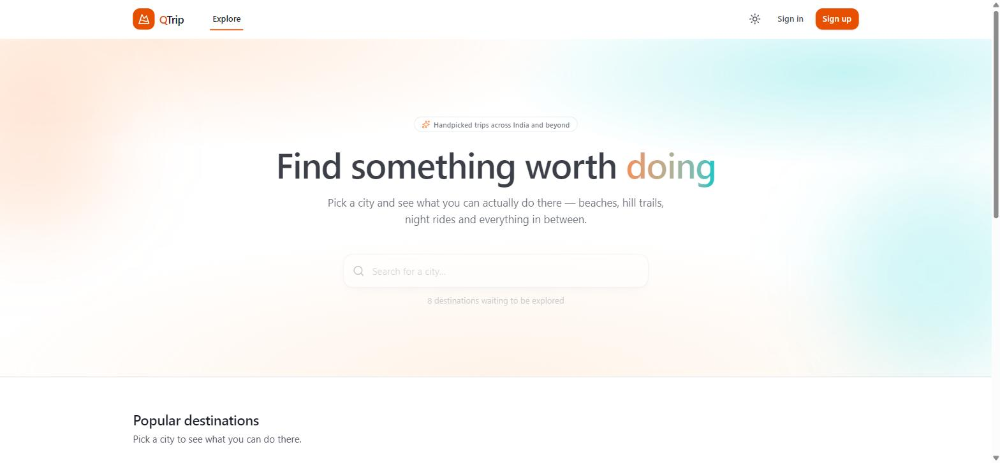
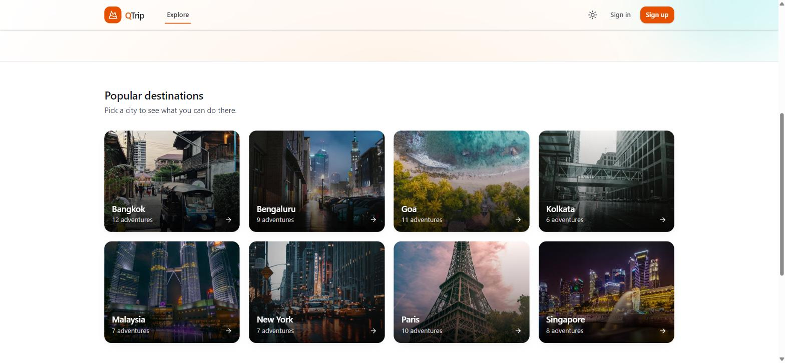
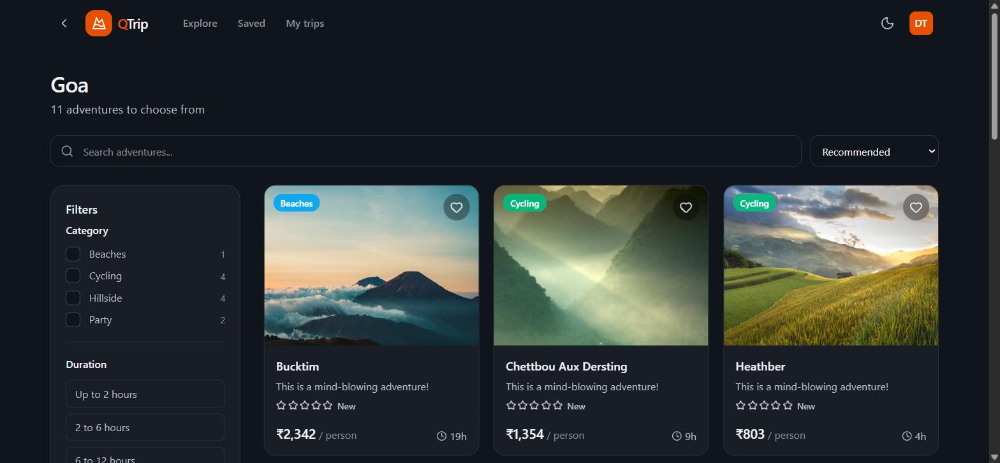
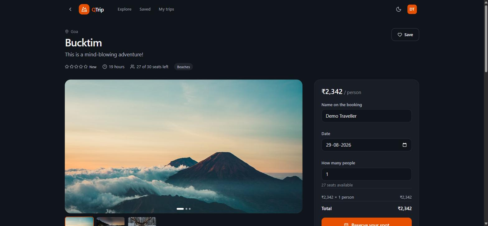
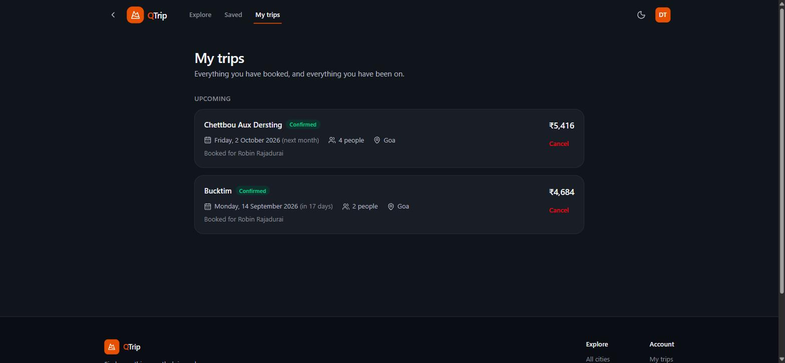
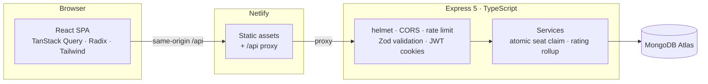

# QTrip

A travel adventure booking app: browse cities, filter adventures server-side,
book seats against real capacity, save favourites and leave reviews.

A React SPA in TypeScript, backed by a TypeScript + MongoDB API.



| | |
| --- | --- |
|  |  |
| Cities, with live adventure counts | Server-side filtering with facet counts |
|  |  |
| Detail, carousel and booking | Your bookings, cancellable |

## Stack

| Layer | Choice |
| --- | --- |
| UI | React 18 + TypeScript (strict) |
| Styling | Tailwind CSS v4 + Radix UI primitives |
| Motion | Framer Motion |
| Data | TanStack Query |
| Forms | React Hook Form + Zod |
| Routing | React Router 7 |
| Build | Vite 6 |
| Tests | Vitest + React Testing Library |
| API | Express 5 + Mongoose 8 + MongoDB ([separate repo](https://github.com/robinrdj/nqtripbackend)) |

## How it fits together



The `/api` proxy is deliberate: it keeps the browser on a single origin, so the
auth cookies stay first-party and survive the tracking protection that would
otherwise drop them.

## Getting started

Requires Node 20+.

```bash
npm install
npm run dev          # frontend on :8081
```

The frontend expects the API on `:8082`. In the backend repo:

```bash
npm run dev:memory   # API + a disposable in-memory MongoDB, seeded
```

That needs no connection string, so the whole app runs from a clean checkout.
Use `npm run dev` there instead to run against a real `MONGODB_URI`, or
`docker compose up` for MongoDB and the API in containers.

Sign in with `demo@qtrip.dev` / `Demo1234`.

| Command | What it does |
| --- | --- |
| `npm run dev` | Vite dev server |
| `npm test` | 73 tests |
| `npm run typecheck` | Type-check without emitting |
| `npm run build` | Type-check, then build to `frontend/dist/` |

## Routes

| Route | Page | |
| --- | --- | --- |
| `/` | Cities, with client-side search | |
| `/adventures?city=<id>` | Filter, search, sort, page | filters live in the URL |
| `/adventures/:id` | Detail, carousel, booking, reviews | |
| `/login`, `/register` | Auth | |
| `/trips` | Your bookings, with cancel | auth |
| `/saved` | Wishlist | auth |
| `/account` | Profile and theme | auth |

## Project layout

```
frontend/src/
  api/client.ts        typed fetch wrappers; ApiError carries per-field detail
  providers/           AuthProvider (session), ThemeProvider (light/dark)
  hooks/queries.ts     every TanStack Query key, hook and mutation
  hooks/useAdventureQuery.ts   filter state, read from and written to the URL
  lib/schemas.ts       Zod schemas mirroring the backend's
  components/ui/       Button, Field, Rating, States (skeleton/empty/error)
  components/          cards, filters, carousel, booking form, reviews
  pages/               one component per route
  styles/app.css       Tailwind theme: tokens, dark palette, utilities
```

**Filter state lives in the URL, not localStorage.** A filtered view is a
shareable link, back and forward step through filter changes, and a reload
restores exactly what was on screen.

**Filtering happens in the database.** The list endpoint returns a page of
results plus facet counts, so the sidebar can show how many adventures each
category would add. Those counts deliberately ignore the category filter —
otherwise ticking one box zeroes every other count.

**The theme is a token swap.** Components reference semantic tokens
(`--surface`, `--ink`, `--line`) rather than palette steps, so dark mode is one
block of redefinitions instead of a `dark:` variant on every element.

**Auth is cookie-based.** Tokens live in httpOnly cookies, so no script on the
page can read them. The client refreshes once on a 401 and replays the original
request; concurrent 401s share a single refresh rather than racing.

## Testing

```bash
npm test
```

73 tests over four layers:

- **API client** — URL building, error mapping, and the refresh-and-replay path
- **URL filter state** — parsing, writing, defaults, and rejecting hand-edited values
- **Components** — cards, filter panel, and the booking form against a mocked API
- **Pages** — loading, empty and error states, and server-side sorting

Three are regression tests for bugs found by driving the real app rather than
by unit tests: a Radix checkbox nested in its own `<label>` cancelled its own
click; a slider whose controlled value was rebuilt each render put the page in
a loop that blocked all input; and native form validation pre-empted Zod, so no
validation message could appear.

## Deploying

CI runs typecheck, tests and a build on every push (`.github/workflows/ci.yml`),
and fails if the shared JS chunk crosses a size budget. Routes are code-split,
so a first visit loads the landing page and the shell rather than the booking
form, review editor and account screens as well.

**Frontend — Netlify.** `netlify.toml` builds from the repo root, publishes
`frontend/dist`, proxies `/api/*` to the API, and adds an SPA fallback plus
security and cache headers. Point the proxy at your API URL before deploying.

**Backend — Render.** `render.yaml` in the backend repo is a blueprint: it sets
the build and start commands, points the health check at `/health`, generates
the JWT secrets, and prompts for `MONGODB_URI` and `CORS_ORIGINS`.

Two things must agree or auth will fail in production:

1. `CORS_ORIGINS` on the API must list the frontend's exact origin. Credentialed
   CORS cannot use a wildcard.
2. The Netlify `/api/*` proxy target must be the deployed API. With the proxy in
   place the frontend needs no build-time backend URL.
